<br>
<br>
.center[

##  `r fontawesome::fa(name = "handshake")`: Kübra Atalay Kabasakal
<br>
--
<br>

##  `r fontawesome::fa(name = "link")`: [Hacettepe Üniversitesi](https://avesis.hacettepe.edu.tr/katalay)
<br>
--
<br>
]
---

## Eğitim ve Deneyim

.center[

```{r echo = FALSE, out.width ="15%"}
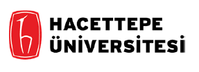


```
]

<br>
--


.three-column[
```{r echo = FALSE, out.width ="65%"}
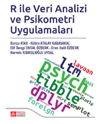

```
]

.three-column[
```{r echo = FALSE, out.width ="100%"}
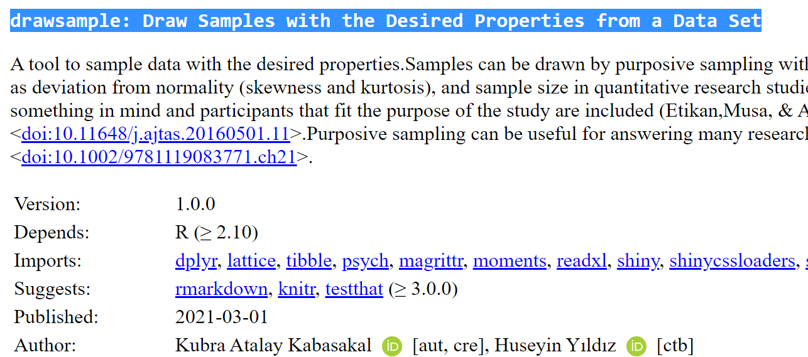

```
]

.three-column[
```{r echo = FALSE, out.width ="100%"}
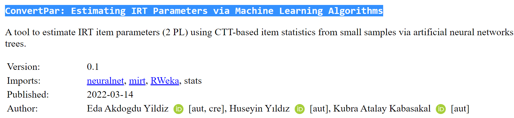

```
]

---
## Eğitim ve Deneyim

```{r echo = FALSE, out.width ="50%"}
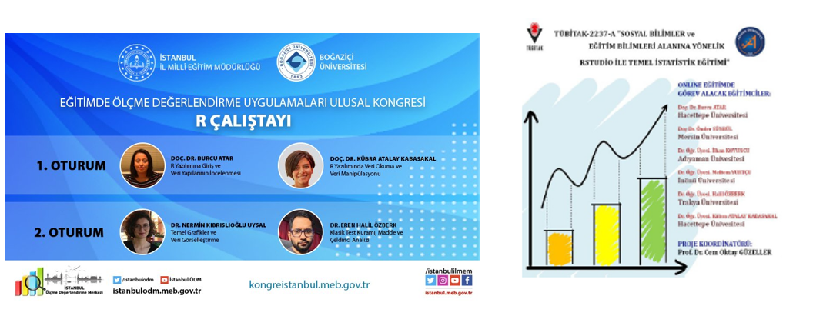
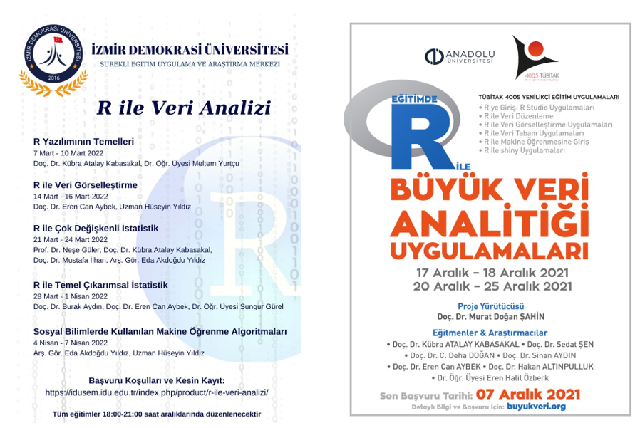

```

---
## Eğitim Bilimlerinde R Kullanımı


```{r echo=FALSE, message=FALSE, warning=FALSE ,fig.align='center',out.width="100%"}
library(DiagrammeR)
library(DiagrammeRsvg) 
library(rsvg) 
my_grap <- mermaid("
        graph TB
        A[2014 - ilk calismalar]
        A-->B[2016 - cok sayida calismada gozlenme]
        B-->C[2019 - siklikla gozlenme ve ticari programların yerini alma]
       
        
           style A fill:#FFF, stroke:#333, stroke-width:5px   
           style B fill:#FFF, stroke:#333, stroke-width:5px
           style C fill:#FFF, stroke:#333, stroke-width:5px

        ")
my_grap
```


---
## Ölçme ve Psikometri Nedir?

.pull-left-wide[
- Klasik Test Kuramı 

  - $\sigma^2_X=\sigma^2_T+\sigma^2_E$

- Madde Tepki Kuramı
  
  - $P_i(\theta) = c_i +\frac{1-c_i}{1+exp(-[a_i(\theta-b_i)])}$

- Genellenebilirik Kuramı
   
  - $\sigma^2(X_{bmp})=\sigma^2_b+\sigma^2_m+ \sigma^2_p+\sigma^2_{bm}+ \sigma^2_{bp} + \sigma^2_{mp}+ \sigma^2_{bmp,e}$

]
.pull-right-narrow[
```{r echo = FALSE, out.width ="50%"}
knitr::include_graphics("img/psikometri_1.PNG")
```
]

---
## Dersin İçeriğini Oluşturma Süreci
.center[
```{r echo = FALSE, out.width ="50%"}
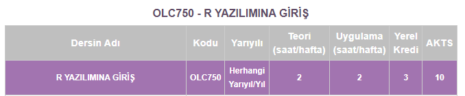
```
]
<br>
<!-- - Ders toplamda 4 defa açıldı. İlk açılış yılı 2017-->

--
.pull-left[

- İhtiyaçlar

- Deneyimler
]
--
.pull-right[

```{r echo = FALSE, out.width ="35%",fig.align='right'}
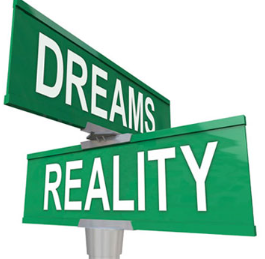
```
]
.center[
```{r echo = FALSE, out.width ="50%"}
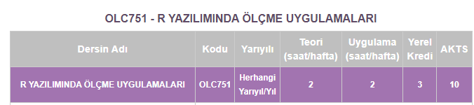
```
]


---
## Psikometrik Analizlerde Kullanılan Programlar

```{r echo=FALSE, message=FALSE, warning=FALSE}
library(wordcloud)
programlar <- c("Iteman","Tap","LISREL","IRTPRO","HLM","BILOG-MG","ConQuest",
                "Facets",
                "IRTLRDIF","IRTEQ","Mplus","DIFAS","HLM","IRT-Lab",
"IPLINK","IRTDIF","IRTGEN","LINKDIF","LOGIST","MOKSCAL",
"MULTILOG","NOHARM","PARSCALE","PRASCH","RASCAL","RUMM2010","TestFact","TestGraf",
"EduG","WinBugs","WinGen","WINSTEPS","XCALIBRE","EQUATE","GLLAMM",
"POLYEQUATE","SPSS","STDIF","Jmetrik",
"Amos", "TESTFACT","DIMTEST")

f= c(sample(40:50,8),    sample(30:40,7),
                                  sample(10:30,5),
                                  sample(1:15,5),
                                  sample(1:13,5),
                                  sample(1:10,5),
                                  sample(1:10,7))
ornek <- data.frame(programlar,f)

wordcloud(words = ornek$programlar, freq = ornek$f, min.freq = 1,           max.words=200, random.order=FALSE, rot.per=0.35,            colors=brewer.pal(8, "Dark2"))
# library(wordcloud2)
# wordcloud2(data=ornek, size = 0.7, shape = 'circle')


```


 

<!-- https://www.umass.edu/education/programs/research-educational-measurement-psychometrics/student-resources-remp -->

---
## Psikometrik Analizlerde Kullanılan Programlar

.pull-left[
```{r echo = FALSE}
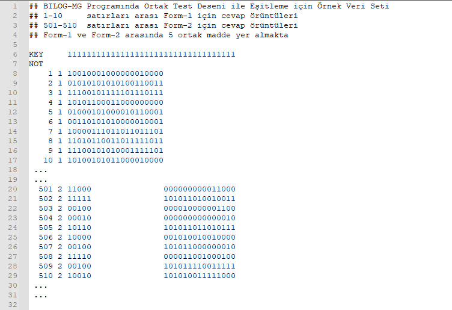
```
]
--
.pull-right[
```{r echo = FALSE, out.width ="120%"}
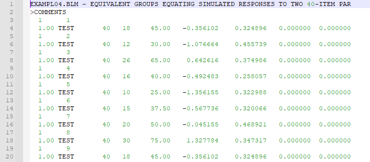
```
]

---
## İçeriğin oluşturulması

```{r echo=FALSE, message=FALSE, warning=FALSE}
library(emojifont)
library(fontawesome)
 load.fontawesome()
 # fontawesome('fa-face-thinking')
```

.pull-left-wide[
- `r fa("r-project", fill = "steelblue")` öğretmeye nereden başlamalıyım? 
 
  - Kurulum
  
  - Paket yükleme
  
  - Nesne Türleri
  
  - Veri okuma-yazma 
  
  - Veri manipulasyonu
  
  - Fonksiyonlar ve Döngüler
  
  - **. . . **
]

--
.pull-right-narrow[

<br>
<br>
<br>

## `r fa("question", fill = "steelblue")`

## `r fa("question", fill = "steelblue")`

]


---
## İçeriğin oluşturulması

- Fonksiyon yazma ihtiyacı

--

  - Veri Düzenleme

--

  - Tekrarlı analizler 
 
--

  - Çoklu çıktı okuma
 
--

  - Hata hesaplanması
  
--

- `r fa("r-project", fill = "steelblue")`'in diğer psikometri programları ile uyumlu sayesinde "toplu işlem dosyalarını" oluşturup çalıştırma

--

- Basıma hazır raporlar oluşturulması


---
## Rutin Konu Başlıkları

.pull-left[
<br>
```{r eval=FALSE}
for(i in 1:5){

  print(i)

  }
```
]

--

.pull-right[
<br>
```{r echo=FALSE}
for(i in 1:5){
print(i)
}
```
]

--

.pull-left[
<br>
```{r eval=FALSE}
for(i in 1:5){

  cat(i," +  ", i ," = ", 2*i,  "\n")

  }
```
]

--

.pull-right[
<br>
```{r echo=FALSE}
for(i in 1:5){
cat(i," +  ", i ," = ", 2*i,  "\n")
}
```

]
---
## Aşina Olunan Konulara Entegre

.pull-left-wide[
```{r}
n_k <- 10                 # Küçük örneklem
n_b <- 50                 # Büyük örneklem

tekrar <- 10000              # Tekrar sayısı
kucuk_orn <- numeric(tekrar) # Küçük örneklem ort.
buyuk_orn <- numeric(tekrar) # Büyük örneklem ort.

orneklem.normal <- rnorm(n = 1000, mean = 35, sd = 15)#Sekil

for (i in 1:tekrar) {
  kucuk_orn[i] <- mean(rnorm(n = n_k,mean =  35, sd = 15)  ) 
  buyuk_orn[i] <- mean(rnorm(n = n_b,mean =  35, sd = 15)  ) 

} 
```
]
.pull-right-narrow[
```{r echo=FALSE}
par(mfrow = c(3,1))
hist(orneklem.normal, breaks = 50, main = "Dağılımı", xlab = "",col = "steelblue")
hist(kucuk_orn, breaks = 50, main = "Küçük Örneklemlerin \n Ortalama Dağılımı", xlab = "Ortalama",col = "steelblue")
hist(buyuk_orn, breaks = 50, main = "Büyük Örneklemlerin \n Ortalama Dağılımı", xlab = "Ortalama",col = "steelblue")
```
]

---
## Aşina Olunan Konulara Entegre


.pull-left-wide[
```{r}
n_k <- 10                 # Küçük örneklem
n_b <- 50                 # Büyük örneklem

tekrar <- 10000              # Tekrar sayısı
kucuk_orn <- numeric(tekrar) # Küçük örneklem ort.
buyuk_orn <- numeric(tekrar) # Büyük örneklem ort.

orneklem.carpik<- rexp(n = 10000, rate = 1.5)#Sekil

for (i in 1:tekrar) {
  kucuk_orn[i] <- mean(rexp(n = 10, rate = 1.5))
  buyuk_orn[i] <- mean(rexp(n = 30, rate = 1.5))

} 
```
]
.pull-right-narrow[
```{r echo=FALSE}
par(mfrow = c(3,1))
hist(orneklem.carpik, breaks = 50, main = "Dağılımı", xlab = "",col = "steelblue")
hist(kucuk_orn, breaks = 50, main = "Küçük Örneklemlerin \n Ortalama Dağılımı", xlab = "Ortalama",col = "steelblue")
hist(buyuk_orn, breaks = 50, main = "Büyük Örneklem \n Ortalama Dağılımı", xlab = "Ortalama",col = "steelblue")
```
]
---
## Fonksiyonlar & Argümanlar

- Hazır fonksiyonların kullanımı açıklamak

```{r eval=FALSE, include=TRUE}
library(CTT)
itemAnalysis(items, itemReport=TRUE, NA.Delete=TRUE, 
             rBisML=FALSE, hardFlag, easyFlag, 
             pBisFlag, bisFlag, flagStyle = c("X",""))
```

--

- Menü ile çalışan programlardan menü kullanımı öğretmek

```{r echo = FALSE,out.width="%30"}
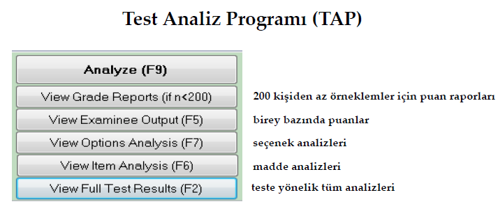
```


---
## Hedef: `r fa("r-project", fill = "steelblue")` Öğrenmeyi Öğretme

```{r echo = FALSE,out.width="%20"}

```

- **daha iyi nasıl öğretebiliriz?**   

--
- **öğrenme yollarını nasıl düzenleyebiliriz?**

---

.center[
<br>
<br>
<br>

.hand[Teşekkürler]

]


<!-- “mirt”(Chalmers,2012), -->

<!-- “lavaan”(Rosseel,2012), -->

<!-- “ltm”(Rizopoulos,2006), -->

<!-- “psych”(Revelle,2020)ve -->

<!-- “sirt”(Robitzsch,2020)olaraksıralanabilir. -->

<!-- dinamikvesürekligelişenbiryapıyasahipolması, -->
<!--  -->
<!-- kullanılacakilgilifonksiyonunarkaplanındakiçalışmamantığınıngörülebiliyorveihtiyacayadaisteğegöredüzenlenebiliyorolması, -->
<!--  -->
<!-- görselleştirmekonusundadiğerprogramlaragörebirçokyenilikvealternatifsunmasınedeniyleRyazılımıeğitimalanındadasıkçakullanılmaktadır. -->


<!-- ```{r echo=FALSE, message=FALSE, warning=FALSE,fig.align='center'} -->
<!-- library(DiagrammeR) -->
<!-- library(DiagrammeRsvg) ; library(rsvg)  -->
<!-- my_grap <- grViz("digraph{ -->

<!--                 graph [layout = dot, -->
<!--                 rankdir = LR]                      -->

<!--                   node [shape = circle, -->
<!--                   style = filled, -->
<!--                   color = steelblue, -->
<!--                   label = ''] -->

<!--                      A[label = '2014 - Eğitim Bilimlerinde R kulanan ilk çalışmalar ',fontsize=30] -->
<!--                      B[label = '2016 - Çok sayıda çalışmada gözlenme  ',fontsize=45] -->
<!--                      C[label = '2019 - sıklıkla gözlenme ve ticari programların yerini alma',fontsize=60] -->


<!--                      edge[color = grey] -->
<!--                      A -> B [color = black] -->
<!--                      B -> C [color = black] -->


<!--                      }") -->